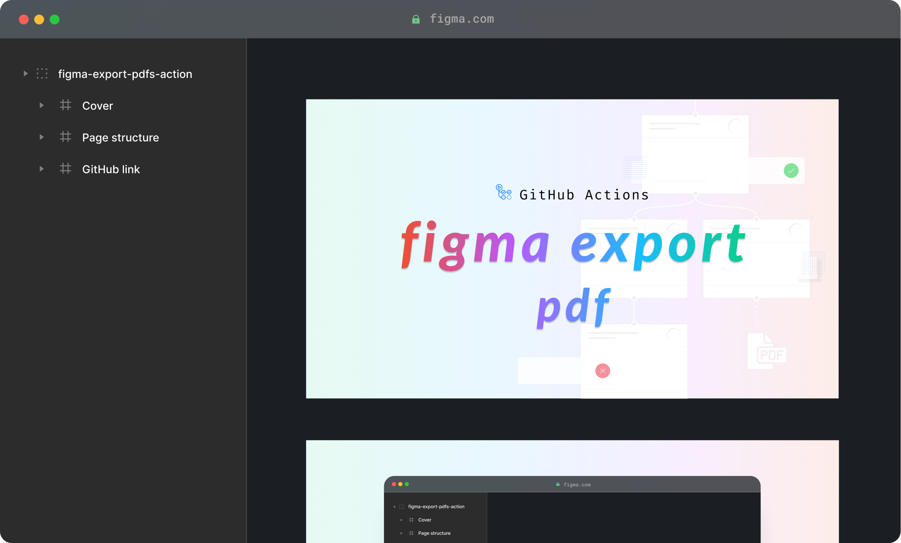

# Figma Export PDFs action

This action can export content from a Figma file as a PDF document. Afterward, you can save the PDF as a workflow artifact, upload it to an FTP server, or store it wherever you prefer.

## Figma file structure

Your Figma file must follow a conventional structure:

```yaml
Figma file
│
├── page
│   │
│   ├── group # this is a PDF document
│   │   ├── frame # page 1
│   │   ├── frame # page 2
│   │   ├── frame # page 3
│   │   └── frame # page 4
│   │
│   └── group # this is a PDF document
│       ├── frame # page 1
│       └── frame # page 2
│
└── page
    │
    └── group # this is a PDF document
        ├── frame # page 1
        ├── frame # page 2
        └── frame # page 3
```

Each Figma **group** in the Figma file represents a PDF document, with the group's name defining the filename of the PDF.

Within each Figma group (PDF document), there are one or more Figma **frames**, where each frame represents a page in the PDF document.

For example, given the Figma file below, the resulting PDF will be named “**figma-export-pdfs-action.pdf**” and will contain 3 pages.




You can refer to [this example](https://www.figma.com/file/VQxKo2pnaksjE7Vql999Qv/figma-export-pdfs-action?node-id=138%3A28) for further clarification.

## Usage

```yaml
- name: Figma Export PDFs
  id: figmaExportPdfs
  uses: marcomontalbano/figma-export-pdfs-action@v1.2.2
  with:
    accessToken: ${{ secrets.FIGMA_ACCESS_TOKEN }}
    fileKey: VQxKo2pnaksjE7Vql999Qv
    ids: ["120:3","138:28"]

- name: Log
  echo "pdfs: $pdfs"
  echo "outDir: $outDir"
  env:
    pdfs: ${{ steps.figmaExportPdfs.outputs.pdfs }}
    outDir: ${{ steps.figmaExportPdfs.outputs.outDir }}
```

Checkout a working example [`dispatch.yaml`](.github/workflows/dispatch.yaml).

### Inputs

| Key           | Required | Description                               | Example                                    | Default |
|---------------|:--------:|-------------------------------------------|--------------------------------------------|:-------:|
| `accessToken` |  **yes** | Figma access token                        | xxxxx-xxxxxxxx-xxxx-xxxx-xxxx-xxxxxxxxxxxx |         |
| `fileKey`     |  **yes** | Figma file key                            | rAJHsSg4SC5NqFIFib5NWz                     |         |
| `ids`         |    no    | List of ids to export. Default to *all*   | ["17:786", "6:786"]                        |   [ ]   |


### Outputs

| Key      | Description                                | Example |
|----------|--------------------------------------------|---------|
| `pdfs`   | List of exported pdfs                      | *       |
| `outDir` | Output directory for all emitted pdf files | ./dist/ |

> **\*** For example a `pdfs` could looks like the following:
> 
> ```json
> [
>   {
>     "id": "6:786",
>     "name": "figma-export-cover",
>     "basename": "figma-export-cover.pdf",
>     "filepath": "./dist/figma-export-cover.pdf",
>     "cover": "./dist/figma-export-cover.jpg"
>   }
> ]
> ```


## Live Example

I created a `cron.yaml` workflow that runs scheduled.

This workflow will export the page "cover" and the page "unit-test" from [this Figma file](https://www.figma.com/file/VQxKo2pnaksjE7Vql999Qv).

You can check the latest run from [this page](https://github.com/marcomontalbano/figma-export-pdfs-action/actions/workflows/cron.yaml) and look at the logs.
An artifact called `my-pdfs` is also available for logged user so that you can check what's the final result.


## Export PDFs directly from Figma

What do you think about exporting Figma content as PDF to an FTP Server, just clicking a button from Figma? Would it be cool, isn't it?

Take a look at this [workflow](.github/workflows/from-figma.yaml) and find out how this is totally feasible. Just clone the workflow and setup [this Figma plugin](https://www.figma.com/community/plugin/1096890502176164513) 😉


